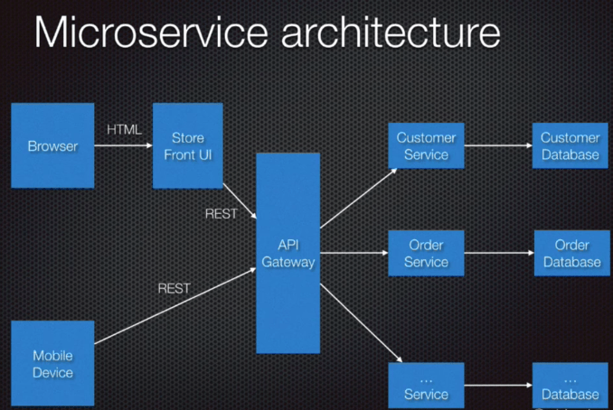
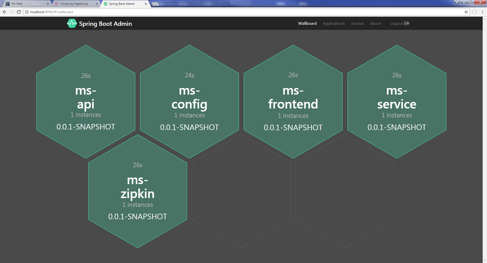
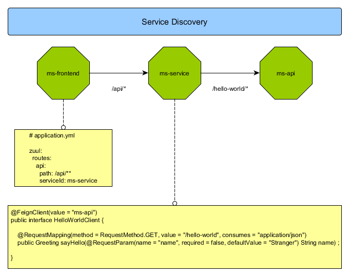
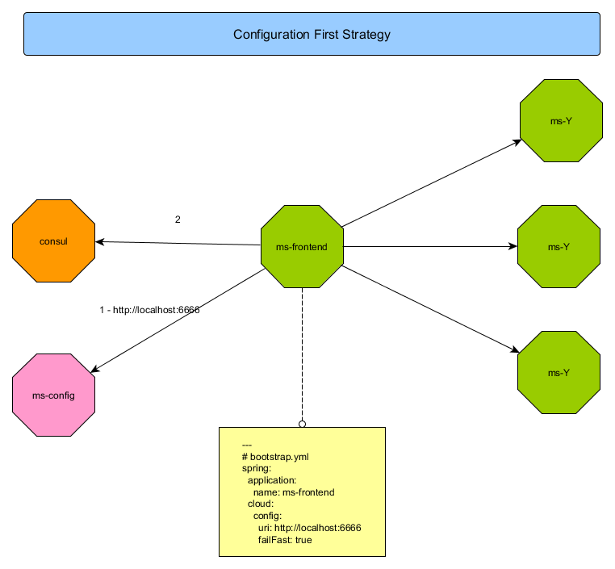
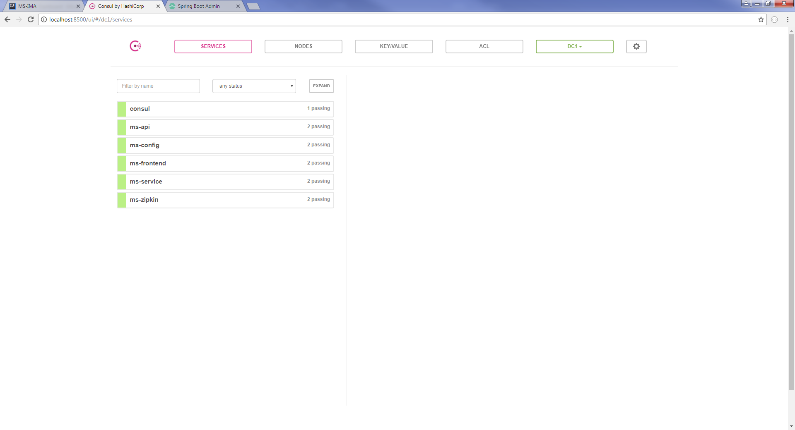

# Architecture Micro Service


## Rappel du concept




# Spring Cloud 2.0.1





Mise en place d'une démo avec Micro services - Spring Cloud et Annuaire de services Consul.

Cas d'utilisation de la démo :




## Version Spring Cloud :

```xml
<spring-cloud.version>Finchley.M9</spring-cloud.version>
```

## Stratégie Config First avec Spring Cloud Config Server


Toutes les applications détiennent un bootstrap.yml, qui va tout d'abord permettre de récupérer sa configuration via le service ms-config.





Exemple bootstrap.yml :

```yml
---
# bootstrap.yml
spring:
  application:
    name: <service-name>
  cloud:
    config:
      uri: ${SERVICE_CONFIG_URL:http://localhost:6666}
      failFast: true
```


## Spring Boot Admin, monitoring des applications

Spring Boot Admin :

```xml
<dependency>
    <groupId>de.codecentric</groupId>
    <artifactId>spring-boot-admin-starter-server</artifactId>
    <version>2.0.0-SNAPSHOT</version>
</dependency>
```


## Installation consul



https://www.consul.io/downloads.html

Copier le fichier consol.exe ou consul pour Linux dans le répertoire ./tools/consul

Lancement consul :

```
    ./consul.sh
```

## Ordre de lancement des services

=> (ms-config, ms-zipkin, ms-api, ms-service, ms-frontend, ms-admin)


## Spring Boot lancement

```
mvn clean spring-boot:run
```

Lancer index.html afin d'accéder à l'application.


## Orchestration des sercices


Trampoline : 

https://github.com/ErnestOrt/Trampoline

Afin de détecter les dernières modifications d'un projet, il faut ajouter le plugin : **pl.project13.maven:git-commit-id-plugin**,
ains que la **org.springframework.boot:spring-boot-devtools** dependance


```xml
<dependencies>
    ...
    <dependency>
        <groupId>org.springframework.boot</groupId>
        <artifactId>spring-boot-devtools</artifactId>
    </dependency>
    ...
</dependencies>


<build>
    <plugins>
        <plugin>
            <groupId>org.springframework.boot</groupId>
            <artifactId>spring-boot-maven-plugin</artifactId>
        </plugin>

        <plugin>
            <groupId>pl.project13.maven</groupId>
            <artifactId>git-commit-id-plugin</artifactId>
        </plugin>
    </plugins>
</build>
```


