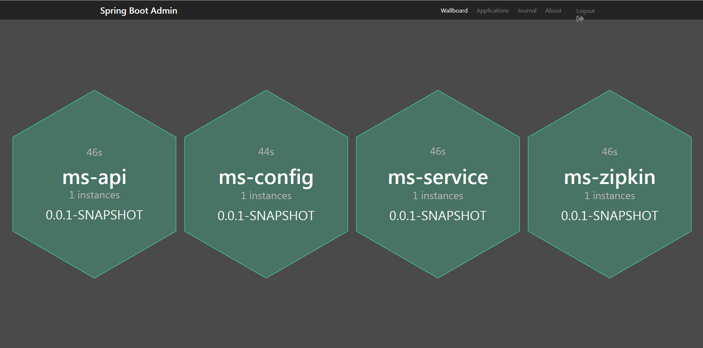
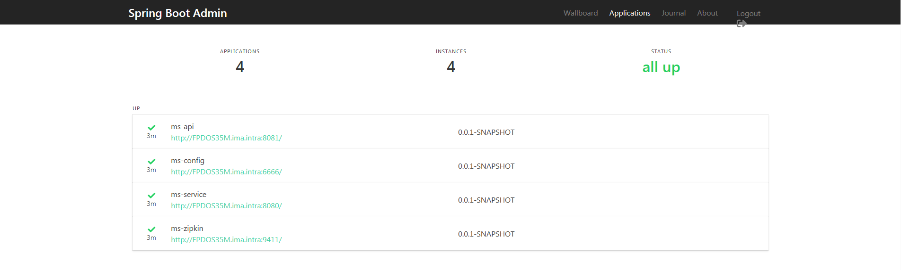
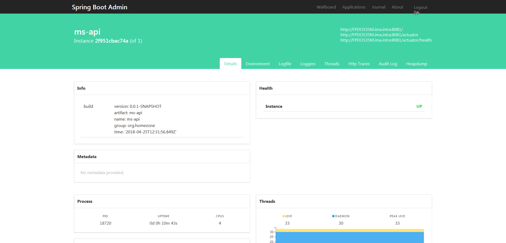

# MS-ADMIN

Outil d'administration / monitoring applicaiton Spring Boot.

[Spring Boot Admin](https://github.com/codecentric/spring-boot-admin)

### Version

```xml
<dependency>
    <groupId>de.codecentric</groupId>
    <artifactId>spring-boot-admin-starter-server</artifactId>
    <version>2.0.0-SNAPSHOT</version>
</dependency>
```

#### Spring admin pour le prototype.



#### Liste des services en activité :




#### Exemple avec ms-api




